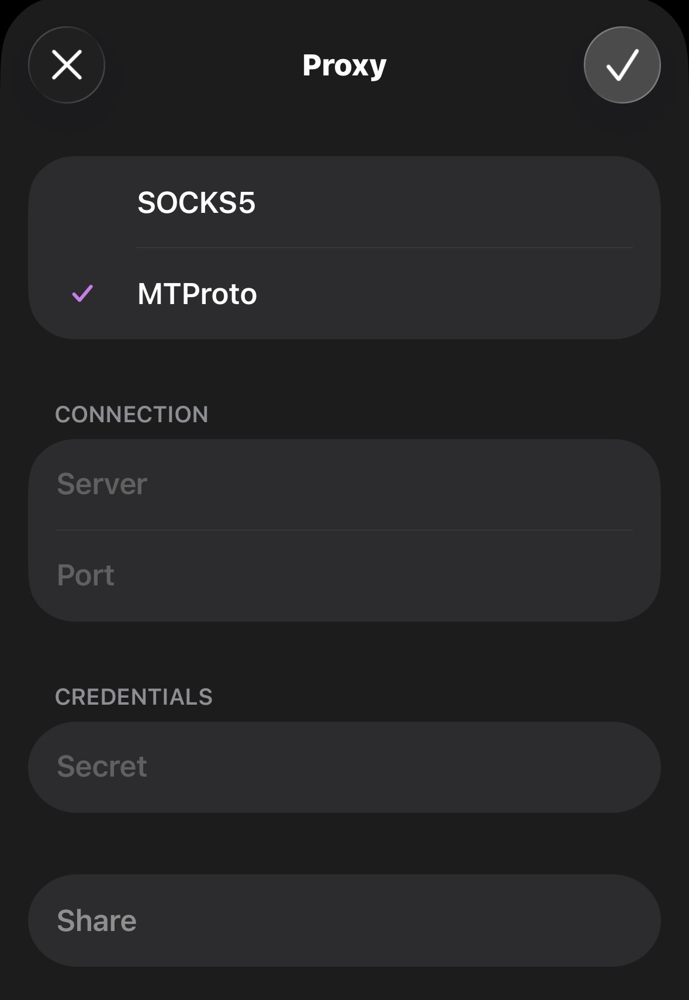

I don't speak a lot about politics and governments, but this time I'm tired of seeing how foolish the governments around the world have become. Instead of accepting their own mistakes and fixing what's wrong, they never miss a chance to take a shitty, foolish step to cover up their mistakes and blame it on someone else.

One such thing happened in my country, India 🇮🇳.

Rather than fixing the corrupt system of mafias who leak the [NEET exam papers](https://en.wikipedia.org/wiki/National_Eligibility_cum_Entrance_Test_(Undergraduate)), and accepting that it's the government's own fault that the NEET paper got leaked before the exam, they blamed everything on TELEGRAM and banned it in India until 22nd June 2026 -- a totally foolish move. Instead of figuring out who the real culprit is, they're just shooting arrows in the dark and banning the most popular chatting app, which makes no sense.

So, as a responsible citizen, here is my small message to the Government of India:

> Please try to fix the problems that already exist, rather than diverting people away from those problems by making foolish moves. You are not a KING, you are not any GOD -- you are the servant of the people (which you eventually forgot you are), and your every action is answerable to the people of the Republic of India.


Enough ranting about foolish, dumb people. Now I'll tell you how to avoid being a puppet of the government and defend your own freedom yourself -- how to self-host your own [MTProto proxy](https://core.telegram.org/mtproto) on your VPS (if you have one, or buy one from any provider like [Hetzner](https://hetzner.com/); it costs just $5/month and can be useful in many other ways) and liberate Telegram.

:::important
If you're following this part now, I've already assumed that you know Linux and its basic use, and that you've already set up Docker on your VPS server.
:::

Once you've SSH'd into your VPS server, follow these steps: 

### Generate a secret and config file for MTProto

```bash
SECRET=$(docker run --rm nineseconds/mtg:2 generate-secret www.google.com)
cat > config.toml <<EOF
secret = "$SECRET"
bind-to = "0.0.0.0:3128"
EOF
cat config.toml
```

This will generate a `config.toml` with `secret` and `bind-to` variables. You can change the port in the `bind-to` variable to whichever one you want to expose.

### Run MTProto proxy server

```bash
docker run -d \
  --name mtg-proxy \
  --restart unless-stopped \
  -p 3128:3128 \
  -v $PWD/config.toml:/config.toml \
  nineseconds/mtg:2
```

Here in `-p 3128:3128`, 3128 is the public port clients connect to. You can use a different public port if 3128 is taken.

:::note
After running the MTProto proxy server, make sure the port you exposed is allowed to connect by the VPS firewall or cloud provider's security group.
:::

### Get your connection link

```bash
docker run --rm -v $PWD/config.toml:/config.toml nineseconds/mtg:2 access /config.toml
```

After running this command, you'll get something like this in the output:

```json
{
  "secret": {
    "hex": "ee....your_secret_hex",
    "base64": "51..your_secret_base64"
  }
}
```

Hooray 🎉, your MTProto proxy server has successfully started and is running! Now copy the `hex` value — you'll need it during the setup in the Telegram app.

### Set up the proxy in the Telegram app



- First, set the proxy type to **MTProto**.
- In the **Server** field, enter the public IP address of the VPS. (You can get it by running this command in the terminal: `curl ipinfo.io/ip` -- it looks something like this: `46.233.121.129`.)
- In the **Port** field, enter the public exposed port you ran the MTProto proxy server on.
- In the **Secret** field, enter the hex value we copied.

Once you've entered all these fields and tapped Done, it'll connect to the MTProto proxy server and your Telegram will start working as normal.


:::tip
When it successfully connects to the proxy, it'll show this logo (highlighted in green) in the status bar.
:::

Congratulations 👏 -- this is a proud moment for you! You've successfully set up your own self-hosted MTProto proxy server. Now you can share it with your friends so they can use Telegram without any interruptions too, and liberate themselves from those foolish orders handed down by a foolish government.

> "Freedom is not given — it is taken"

If you don't want to self-host your own MTProto proxy server, then here's a GitHub repo that contains a list of free, public MTProto proxy servers you can use:

::github{repo="SoliSpirit/mtproto"}

#### Got stuck somewhere?

If you ran into any issues while following this guide, feel free to reach out to me at eq.itskanishkp@gmail.com. I'll try my best to address them as soon as I can!
