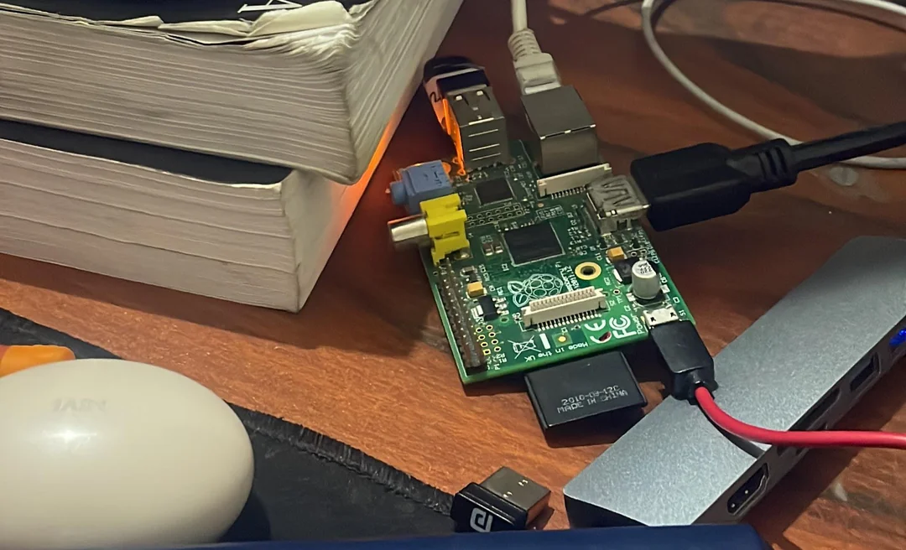
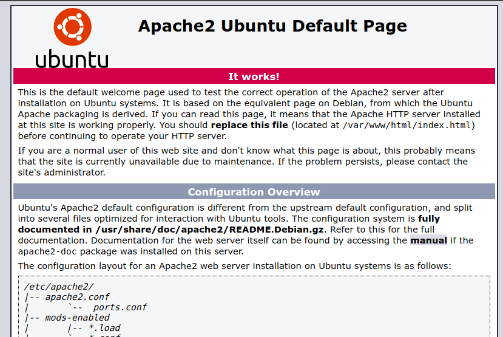
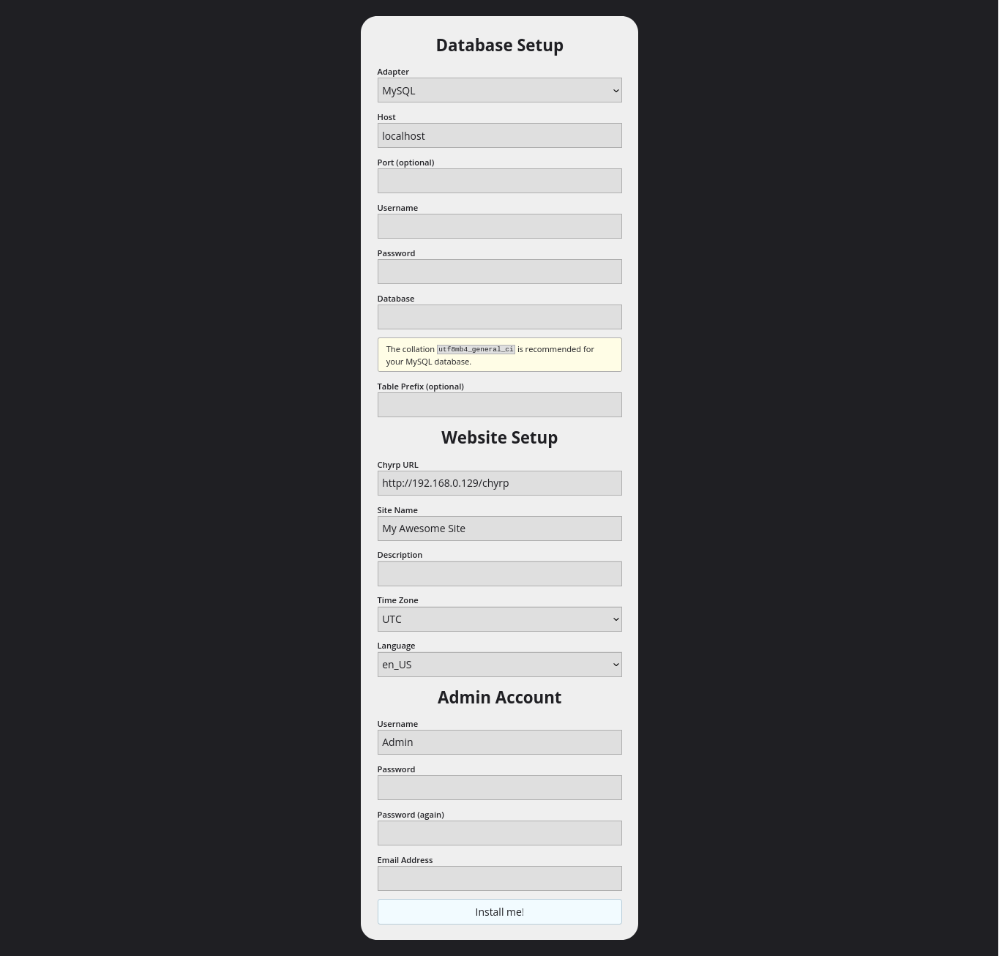
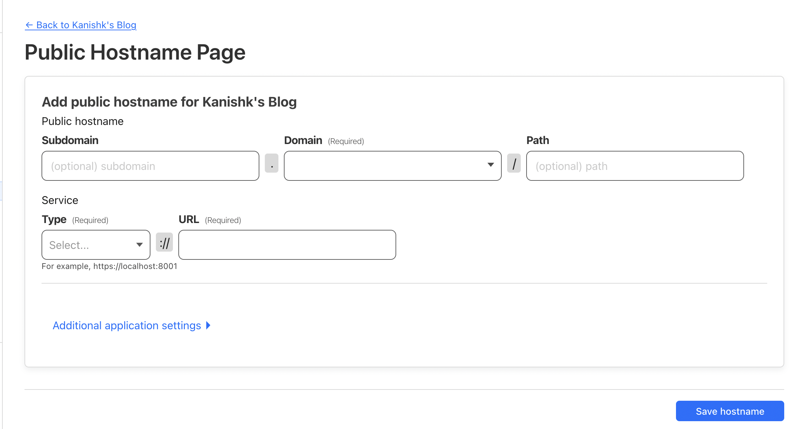
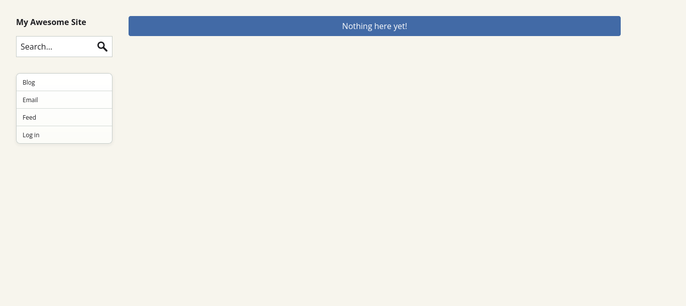

> People said I should accept the world. Bullshit! I don't accept the world. - Richard M. Stallman

## The Self-Hosting Manifesto

In a world of convenient cloud services and platform dependencies, we choose a different path:

### Our Principles

 1. **Independence:** We rely on our own Linux machines, not external platforms.
 2. **Skill Cultivation:** What others see as a "skill issue," we see as an opportunity for growth.
 3. **Time Investment:** We value long-term control over short-term convenience.

### Our Philosophy

> "Self-hosting isn't just about saving time;
> it's about owning our digital destiny."

### Our Toolbox

*  **Computer:** That can Run Linux
*  **Linux:** Our foundation
*  **Open-source software:** Our building blocks
*  **Curiosity:** Our most valuable asset

### Our Reward

Mastery over our digital environment, unmatched privacy, and the satisfaction of true ownership.

*Remember: Every service you self-host is a vote for digital sovereignty.*

 ***


 I'm a fan of self-hosting and prefer to use my Linux machine for services that other platforms offer, as I can easily manage them myself. I view it as a matter of skill rather than just a time-saving measure, as I have a lot of curiosity about how things work. Last month, I discovered an old Raspberry Pi Model B Rev 2[^1] in my electronics box . Although it's a very old model with the following specs:


 

```
OS: Raspbian GNU/Linux 12 (bookworm) armv6l 
Host: Raspberry Pi Model B Rev 2 
Kernel: 6.6.31+rpt-rpi-v6 
Uptime: 1 day, 10 hours, 59 mins 
Packages: 847 (dpkg) 
Shell: bash 5.2.15 
Terminal: /dev/pts/0 
CPU: BCM2835 (1) @ 700MHz 
Memory: 32MiB / 174MiB 
```

 I realized that while it may not be powerful, it could still be useful. So, I came up with the idea of using it to host my blog. I want to share the process of how I set it up to host the blog you're reading now.

 We are going to host [chyrp-lite](https://github.com/xenocrat/chyrp-lite) which is *an ultra-lightweight blogging engine* on a Ubuntu based machine ( You can use any linux based machine )
## Prerequisites

*  Working Machine
*  Active Internet ( 24/7 )
*  Active Power Supply ( 24/7 )

### Step - 1 ( Setup Secure Shell (SSH) access to your server )

**1. Install SSH server:**

```
sudo apt update
sudo apt-get install openssh-server
```

Now after this you are good to go, you can connect to your server using `ssh username@MachineIPAddress`, make sure both the device should be connected to the same [LAN](https://en.wikipedia.org/wiki/Local_area_network)

To find the IP address of the machine, use the command `hostname -I` , it usually starts with `192.XXX.XX.XXX` .

### Step - 2 ( Configure the firewall )

 Why we are using firewall ? because it provide protection against outside cyber attackers by shielding your computer or network from malicious or unnecessary network traffic , to know more about it, refer to this [article](https://www.cisa.gov/news-events/news/understanding-firewalls-home-and-small-office-use)

**1. Install UFW:**

```
sudo apt update
sudo apt install ufw
```

**2. Allow SSH (port 22):**

```
sudo ufw allow 22/tcp
sudo ufw allow OpenSSH
```

**3. Allow HTTP (port 80):**

```
sudo ufw allow 80/tcp
sudo ufw allow 80
```

  **4. Allow HTTPS (port 443):**

```
sudo ufw allow 443
```

**5. Allow both HTTP and HTTPS:**

 ```
 sudo ufw allow 80,443/tcp
 ```
 
 **6. Allow WWW Full profile:**
 
 ```
 sudo ufw allow "WWW Full"
 ```
 
 **7. Enable the firewall:**
 
 ```
 sudo ufw enable
 ```
 
 **8. Verify the rules:**
 
 ```
 sudo ufw status verbose
 ```

### Step - 3 ( Setup the Web-Server )
 
 We need to setup a web server, but why ? Okay, imagine you have a bunch of cool pictures and stories you want to show to all your friends, even when they're at their own houses. A web server is like a magic box that lets you put those pictures and stories on the internet so anyone can see them from their computer or phone. It's like having a big bulletin board that's visible to the whole world! or in more technical details, The primary function of Web Server is to store, process and serve the web pages to the clients. It uses HTTP protocol to bring the user the webpage he wants to see. *We are installing Apache web server* , again but why Apache ref. [What is apache web server](https://serverguy.com/what-is-apache-web-server/)
 
 **1. Installing Apache**
 
 ```
 sudo apt update
 sudo apt install apache2
 ```

 After letting the command run, all required packages are installed and we can test it out by typing in our IP address for the web server.
 

 
 If you see the page above, it means that Apache has been successfully installed on your server!
### Step - 4 ( Setup the Database )
 
 Now we need to setup a database on our machine but why we need a Database? In simple words, the Database is the place in which we store the data of our blog, safely and securely, Some good articles that would help you to understand [What is a Database and why we need one.](https://blog.airtable.com/what-is-a-database/)
 
 There are a lot of databases out there but we are using [MySQL](https://www.mysql.com/) , you can know all about MySQL and it's all features here ref. [What is MySQL](https://www.oracle.com/in/mysql/what-is-mysql/)
 
 **1. Installing MySQL**
 
 ```
 sudo apt update
 sudo apt install mysql-server
 ```
 
 **2. Ensure that the server is running**
 
 ```
 sudo systemctl start mysql.service
 ```
 
 **3. Configuring MySQL**
 
 ```
 sudo mysql_secure_installation
 ```
 
 **4. Testing MySQL**
 
 ```
 sudo systemctl status mysql.service
 ```

You'll see output similar to the following:
 
 ```
 mysql.service - MySQL Community Server
  Loaded: loaded (/lib/systemd/system/mysql.service; enabled; vendor preset: enabled)
  Active: active (running) since Tue 2024-04-21 11:56:48 IST; 6min ago
  Main PID: 10382 (mysqld)
  Status: "Server is operational"
  Tasks: 39 (limit: 1137)
  Memory: 370.0M
  CGroup: /system.slice/mysql.service
  ??10382 /usr/sbin/mysqld
 ```

 Now your MySQL should be setup properly, there are some steps remaining like creating the user and setup the Database but for now we'll leave it and we'll do it when we setup our blog.

### Step - 5 ( Installing PHP )
 
 Now we need to install [PHP](https://www.php.net/), We need PHP because our blog engine [chyrp-lite](https://github.com/xenocrat/chyrp-lite) is written in this [programming language](https://en.m.wikipedia.org/wiki/Programming_language)
 
 **1. Install PHP**
 
 ```
 sudo apt update
 
 sudo apt install php libapache2-mod-php php-mysql php-mbstring 
 ```
 
 The above command includes three packages:-
 * php - To Install PHP
 * libapache2-mod-php - It is Used by apache to handle PHP files
 * php-mysql - It is a PHP module that allows PHP to connect to MySQL 
 * php-mbstring - It is a PHP module that provides multibyte specific string functions that help you deal with multibyte encodings in PHP.

### Step - 6 ( Setting up our Chyrp Lite Blog Engine )
 
**1. Essential tools**

 ```
 sudo apt update
 
 sudo apt install curl wget
 ```
 
 The above command includes two tools:-
 
 * curl - use to transfer data to and from a server.
 * wget - use to download files.
 
 **2. Downloading the Chyrp Lite Blog Engine**
 
 We can download the latest version of Chyrp Lite Blog Engine, by the [release page](https://github.com/xenocrat/chyrp-lite/releases/tag/v2024.03) 
 
 * Downloading the engine using `wget`
 ```
 wget https://github.com/xenocrat/chyrp-lite/archive/refs/tags/v2024.03.zip
 ```
 
 * unzip the engine files
 ```
 unzip v2024.03.zip
 ```
 
 * Moving Engine to the Web Server
 ```
 sudo mv chryp* /var/www/html/chyrp-lite
 ```
 
 * Set proper permissions
 ```
 sudo chown -R www-data:www-data /var/www/html/chyrp-lite
 
 sudo chmod -R 755 /var/www/html/chyrp-lite
 ```
 
 **3. Database Configuration**
 
 * Open MySQL commandline
 ```
 sudo mysql -u root -p
 ```
 
 * Setup Database
 ```
 CREATE DATABASE chyrp_lite;
 
 CREATE USER 'chyrp_user'@'localhost' IDENTIFIED BY 'your_password';
 
 GRANT ALL PRIVILEGES ON chyrp_lite.* TO 'chyrp_user'@'localhost';
 
 FLUSH PRIVILEGES;
 
 EXIT;
 ```
 
 ==Make sure to Replace 'your_password' with a secure password==
 
 **4. Webserver Configuration**
 
 * Open Apache2 configuration files
 ```
  cd /etc/apache2/sites-available
 ```
 
 So, when you go to this folder and list the available files and directories there using `ls` command you'll see,
 
 ```
 000-default.conf default-ssl.conf
 ```
 
 these are the files which are responsible for what you see when you visit your web server, by typing you IP address. By default it shows `/var/www/html` which is defined by this line `DocumentRoot /var/www/html` in `000-default.conf` and `default-ssl.conf` , but we need to change it to `DocumentRoot /var/www/html/chyrp-lite` in order to show our blog when we visit our IP address.
 
 * Changing DocumentRoot in the config files
 
 ```
 sudo sed -i 's|DocumentRoot /var/www/html|DocumentRoot /var/www/html/chyrp-lite|' 000-default.conf
 
 sudo sed -i 's|DocumentRoot /var/www/html|DocumentRoot /var/www/html/chyrp-lite|' default-ssl.conf
 ```
 
 Now you are good to go, when you the browser, and go to `http://your_computer_ip/chyrp-lite/install.php` you'll see the following page:-
 
 
 
 Here you need to enter the following things:-
 
 * Adapter - Select MySQL here.
 * Username - chyrp_user
 * Password - (the password that you set for chyrp_user)
 * Database - chyrp_lite
 * Chyrp URL - http://your_computer_ip
 * Site Name - your site name
 * Description - your site descriptipn
 
 Admin Section
 * Username - admin user name
 * Password - admin password
 * Email Address - admin email address
 
 Now click install me, after this the chyrp blog engine is successfully setup on your machine, you can check by visiting `http://your_server_ip_address`
 
 So, the Blog has been setup now what's next ?, Currently our blog is accessible only to our LAN( Local Area Network), means that device which are connected with the same network as you, are only able to access this blog site, but we want that anyone from anywhere can access it,We need a Public IP to do so, and comes the role of [ Cloudflare Tunnel](https://www.cloudflare.com/products/tunnel/) , We are going to use the Cloudflare Tunnel to expose our Local IP to the Globe ie. to Public IP. 

### Step - 7 ( Setup CloudFlare Tunnel )

 There are a lot of videos out there on YouTube which which help you to setup CloudFlare Tunnel and it's your choice to choose from any of those videos but I'm mentioning some videos here, which I prefer:-

 <iframe width="560" height="315" src="https://www.youtube.com/embed/ey4u7OUAF3c?si=wYtm9uH6p7tGgOwF" title="YouTube video player" frameborder="0" allow="accelerometer; autoplay; clipboard-write; encrypted-media; gyroscope; picture-in-picture; web-share" referrerpolicy="strict-origin-when-cross-origin" allowfullscreen></iframe>

---

 <iframe width="560" height="315" src="https://www.youtube.com/embed/CfjGCI6bQz4?si=J_VE23NAtOMl9V2B" title="YouTube video player" frameborder="0" allow="accelerometer; autoplay; clipboard-write; encrypted-media; gyroscope; picture-in-picture; web-share" referrerpolicy="strict-origin-when-cross-origin" allowfullscreen></iframe>
 
 **1. Tunneling our Blog via CloudFlare Tunnel**
 
 
 
 * Subdomain - enter your [subdomain](https://en.wikipedia.org/wiki/Subdomain)
 * Domain - select your domain
 * Type - http://
 * URL - localhost:80
 
 
 **2. Set Tunnel Domain URL in blog engine configuration**
 
 ```
 cd /var/www/html/chyrp-lite/includes
 
 sed -i 's|http://you_ip_address|http://your_tunnel_domain|g' config.json.php
 ```
 
 After setting this, you'll able to visit your blog by searching your domain ?, You'll see a page something like this.
 

 
 
  **Congratulations! You have successfully set up your blog on your own machine. This is a proud moment, so take a moment to pause and applaud yourself.**
 
 <div style="width:100%;height:0;padding-bottom:72%;position:relative;"><iframe src="https://giphy.com/embed/l3q2XhfQ8oCkm1Ts4" width="100%" height="100%" style="position:absolute" frameBorder="0" class="giphy-embed" allowFullScreen></iframe></div><p><a href="https://giphy.com/gifs/oscars-academy-awards-oscars1990-l3q2XhfQ8oCkm1Ts4">via GIPHY</a></p>
 
 > Remember: This is just the beginning of your self-hosting journey. This blog is intended to be a great starting point, but your exploration shouldn't end here. There are countless other things you can self-host, such as backup systems, cloud storage, photo storage, and even language models. All you need is the curiosity to explore these possibilities. Best of luck on your self-hosting adventure!
 
 ***Note: If you stuck somewhere, in the process try to google the problem with `How to fix (your_problem)` if it still doesn't fix, you can [mail me](mailto:itskanishkp.py@gmail.com) , I'll surely help you in fixing your problem.***
 
 
 [^1]: Special thanks to my teacher [Gaurav Parashar Sir](https://www.gauravparashar.com/) for donating me this **Raspberry Pi Model B Rev 2** and [Tushar Gupta Sir](https://tushar5526.github.io/) for introducing me to self-hosting.
